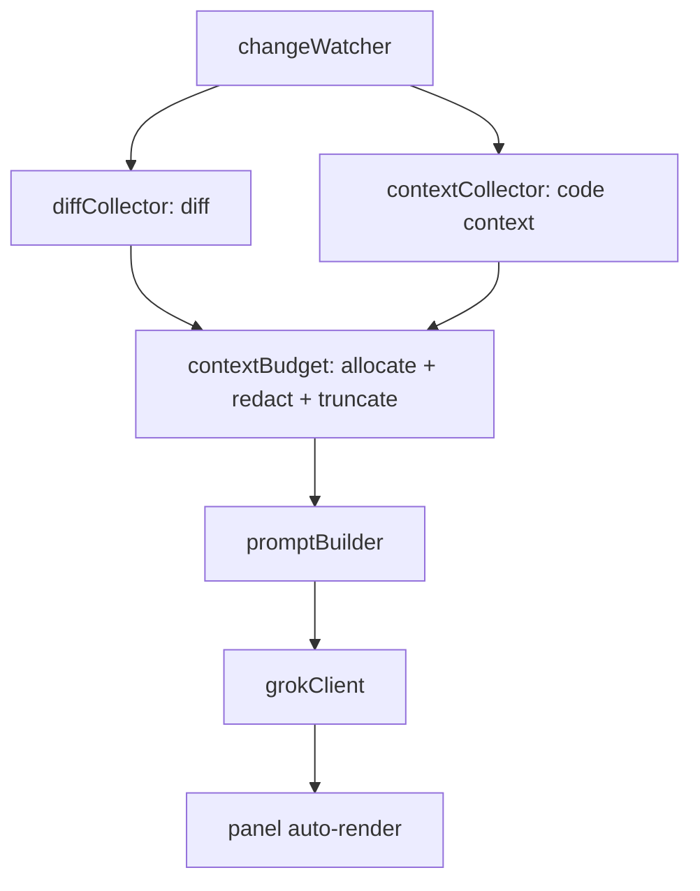

# Clarity Diff — Code Context Plan (Tiers 1–3)

Goal: give the explanation engine more of the surrounding code so it can reason about a
change instead of guessing from a keyhole diff. This is delivered as **three tiers of
increasing context and effort**, all sharing one budget + redaction pipeline.

- **Tier 1 — Changed files + project map** (easy, ~80% of the value)
- **Tier 2 — Neighbor files + small-repo packing** (medium)
- **Tier 3 — Retrieval / embeddings** (hard, scalable)

Each tier is independently shippable and gated by a setting, so we can build and release
them one at a time. All tiers reuse the existing redact + truncate machinery in
[`safetyScanner`](../src/analysis/safetyScanner.ts) and honor the consent gate.

> Related (out of scope for this file): using the *real* Cursor prompt to flag
> "unrefined prompts" (user asked X but got Y). Tracked separately; this file is only
> about code context.

---

## 0. Current state

Today the pipeline sends only the unified diff:

`changeWatcher` -> [`diffCollector.collect`](../src/analysis/diffCollector.ts) ->
`CollectedDiff { diffText, files, fingerprint, truncated, redacted }` ->
[`grokClient.explain`](../src/llm/grokClient.ts) ->
[`buildMessages`](../src/llm/promptBuilder.ts).

We will add a parallel **`contextCollector`** that produces a `CodeContext`, thread it
through `explain` into `buildMessages`, and render a small "context used" note in the
panel.



---

## 1. Shared infrastructure (build first, before any tier)

### 1.1 New types — [`src/types/index.ts`](../src/types/index.ts)

```ts
export interface ContextFile {
  path: string;          // workspace-relative
  content: string;       // redacted, possibly truncated
  truncated: boolean;
  reason: "changed" | "neighbor" | "manifest" | "retrieved";
}

export interface ProjectMap {
  tree: string;                 // indented file tree (gitignore-respecting)
  manifests: ContextFile[];     // package.json, README, tsconfig, etc.
}

export interface CodeContext {
  files: ContextFile[];         // changed + neighbor + retrieved
  projectMap?: ProjectMap;
  totalBytes: number;
  truncated: boolean;           // context budget was hit
  redacted: boolean;
  level: ContextLevel;          // which tier actually ran
}

export type ContextLevel = "diffOnly" | "changedFiles" | "neighbors" | "repo" | "retrieval";
```

### 1.2 New settings — [`package.json`](../package.json) + [`settings.ts`](../src/config/settings.ts)

- `clarityDiff.contextLevel` (enum: `diffOnly` | `changedFiles` | `neighbors` | `repo` | `retrieval`; default `changedFiles`).
- `clarityDiff.maxContextBytes` (number, default `120000`) — budget for code context, separate from `maxDiffBytes`.
- `clarityDiff.contextExcludeGlobs` (string[]) — extra denylist patterns.

### 1.3 Budget + safety — new [`src/analysis/contextBudget.ts`](../src/analysis/contextBudget.ts)

- Allocate the byte budget in priority order: **diff → changed-file contents → project map/manifests → neighbors → retrieved chunks**.
- Every file passes through `redactSecrets` then `truncateToBytes` (reuse `safetyScanner`).
- Hard **denylist** (never send, regardless of tier): `.env*`, `*.pem/key`, lockfiles (`package-lock.json`, `pnpm-lock.yaml`), `node_modules/`, `dist/`, `build/`, `.git/`, binaries/images, files over a per-file cap (e.g. 64 KB).
- Skip files already fully represented by the diff to avoid duplication.

### 1.4 Wiring

- Add `contextCollector` to [`ClarityController`](../src/extension.ts); call it in `runAnalysis` alongside `diffCollector`, fold its `redacted`/`truncated` flags into the result notice.
- Extend `grokClient.explain(intent, diff, context, opts)` and `buildMessages(intent, diff, context)`.
- Fingerprint stays diff-based (context changes alone should not force re-analysis unless the diff changed).

Effort: ~2–3 hours (types, settings, budget module, wiring, prompt plumbing).

---

## 2. Tier 1 — Changed files + project map (Easy)

New module: [`src/analysis/contextCollector.ts`](../src/analysis/contextCollector.ts)

### 2.1 Full changed-file contents
- For each non-deleted changed file from `gitDiffService`, read current content via
  `vscode.workspace.fs.readFile` (respects the workspace, works remotely).
- Apply denylist, per-file cap, redaction, truncation. Tag `reason: "changed"`.
- Gives the model the whole function/file, not just hunks.

### 2.2 Project map
- File tree via `git ls-files` (tracked, gitignore-respecting) rendered as an indented tree, capped in depth/entries.
- Include contents of key **manifests**: `package.json`, `README*`, `tsconfig.json`, framework configs (small, tagged `reason: "manifest"`). Delivers the PRD "basic architecture overview."

### 2.3 Prompt — [`promptBuilder.ts`](../src/llm/promptBuilder.ts)
- Add sections: `PROJECT MAP`, `CHANGED FILES (full contents)`, `KEY FILES`.
- Instruct the model to use them for `structureFit` and deeper `summary`/`glossary`.

### 2.4 UI
- Panel note: "Context: 3 files + project map" so the user sees what was sent.

Effort: ~2–4 hours. Ship as `contextLevel: "changedFiles"` (new default).

---

## 3. Tier 2 — Neighbor files + small-repo packing (Medium)

Extends `contextCollector`.

### 3.1 Import neighbors
- Parse `import ... from "x"` / `require("x")` (and dynamic `import()`) in changed files with a lightweight regex per language (start with JS/TS/Python).
- Resolve relative specifiers to real files in the repo; read + include them (`reason: "neighbor"`).
- Optional reverse neighbors (who imports the changed file) via `git grep` — behind a flag; more expensive.

### 3.2 Small-repo packing
- If total tracked source (from `git ls-files`, filtered by source extensions) fits under `maxContextBytes`, include the whole repo (grok-4.5 has ~500k-token context, so small/medium repos fit).
- Otherwise fall back to changed + neighbors.

### 3.3 Prompt/UI
- New `RELATED FILES` section; note "Context: changed + 5 related files."

Effort: ~half day (import parsing + resolver + packing + tests). Ship as
`contextLevel: "neighbors"` / `"repo"`.

---

## 4. Tier 3 — Retrieval / embeddings (Hard)

New area: `src/retrieval/`.

### 4.1 Index
- Chunk repo files (by function/heading or fixed windows), embed each chunk, store vectors on disk in `context.globalStorageUri` (JSON or sqlite).
- Build on first run; **incrementally re-embed only changed files** on settle (reuse `changeWatcher`).

### 4.2 Retrieve
- Embed the diff + changed files, cosine-search top-K relevant chunks, include them (`reason: "retrieved"`) within budget.

### 4.3 Provider
- Prefer an xAI embeddings endpoint if available; otherwise a local model (e.g. transformers.js) to avoid sending code — decide based on privacy vs. footprint.

### 4.4 Concerns
- Dependencies (vector math / sqlite / possibly a local model), index invalidation, cold-start cost, and **more code leaving the machine** (if cloud embeddings) — extend the consent copy.

Effort: 2–4 days. Ship as `contextLevel: "retrieval"`, off by default.

---

## 5. Testing

- Pure-function smoke tests (extend [`test/smoke.ts`](../test/smoke.ts)):
  - `contextBudget` priority allocation + per-file cap + denylist.
  - Tree rendering from a file list.
  - Import-specifier extraction + relative resolution (Tier 2).
- Manual E2E per tier via F5 / VSIX: verify the panel note and that explanations improve.

---

## 6. Build order (milestones)

1. **M0 — Shared infra** (§1): types, settings, `contextBudget`, wiring, prompt plumbing.
2. **M1 — Tier 1** (§2): changed-file contents + project map. Make it the default. Release.
3. **M2 — Tier 2** (§3): neighbors + small-repo packing. Release.
4. **M3 — Tier 3** (§4): retrieval, off by default. Release as experimental.

Each milestone: bump version, `npm run build`, `vsce package`, reinstall, smoke tests green.

---

## 7. Risks & tradeoffs

- **Cost/latency**: more context = more tokens. Mitigate with `maxContextBytes` and tiering.
- **Privacy**: more code is sent to xAI. Redaction + denylist + consent are mandatory; surface a clear "context used" note.
- **Duplication**: don't resend what the diff already shows.
- **Language coverage** (Tier 2): import parsing starts JS/TS/Python; others degrade to Tier 1 gracefully.
- **Index staleness** (Tier 3): must invalidate on file changes.
